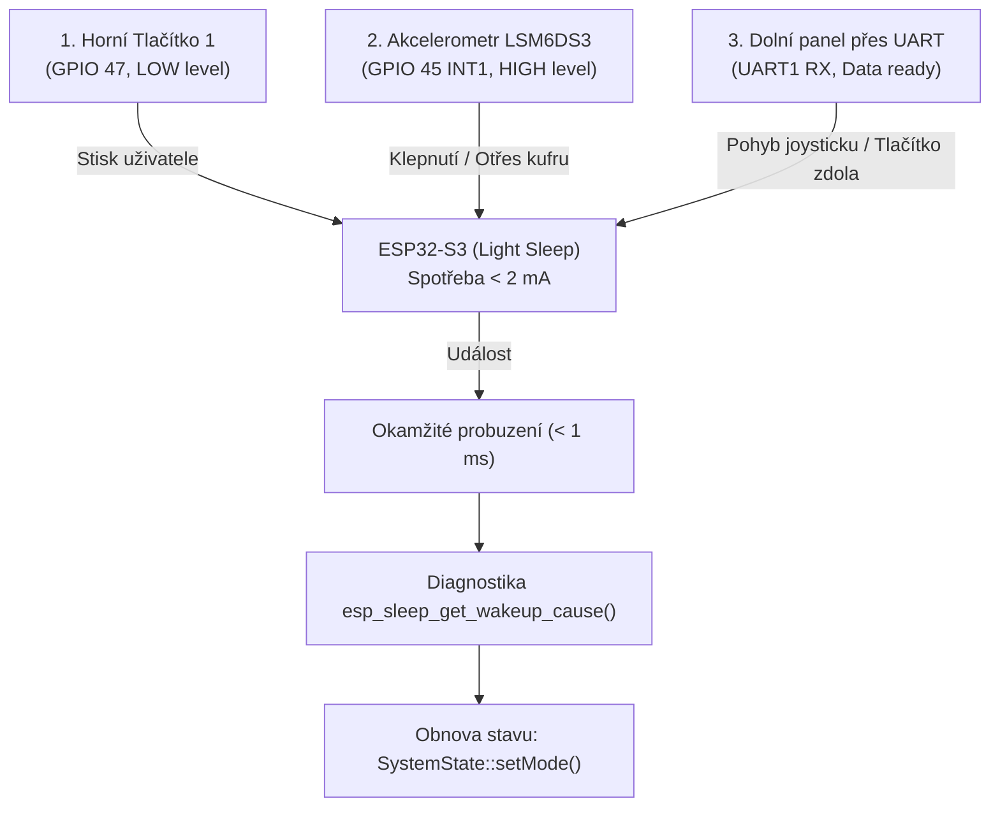

# 08. Úsporný režim Light Sleep a asynchronní probouzení (Wake-up Zdroje)

## 1. Úvod a formulace problému
Při vývoji bateriově nebo dlouhodobě napájených vestavěných systémů (Embedded Systems), jako je náš **ESP-Demo-Box**, je klíčovým parametrem celková energetická bilance zařízení. Mikrokontrolér ESP32-S3 při plném taktu dvou jader na frekvenci **240 MHz** a se zapnutým Wi-Fi/Bluetooth vysílačem odebírá proud v rozmezí **100 mA až 250 mA**. V klidovém stavu (kdy uživatel s demo boxem neinteraguje) by takový trvalý odběr vedl k rychlému vybití bateriového článku nebo zbytečnému zahřívání komponent uvnitř uzavřeného kufru.

Cílem bylo implementovat inteligentní režim spánku (**Sleep Mode**), který po dokončení demo prezentace uvede systém do klidového stavu s minimálním odběrem proudu, ale zároveň umožní **okamžité a plynulé probuzení** bez nutnosti provádět kompletní studený restart systému (Cold Boot).

Během implementace a testování jsme však narazili na závažné systémové komplikace:
1. **Hardwarový konflikt s Octal SPI Flash/PSRAM sběrnicí:** Volba nesprávného GPIO pinu pro přerušení vedla k okamžitému pádu řadiče cache paměti a pádu procesoru.
2. **Kolize úloh a zacyklení Watchdogu (TG1WDT):** Nesprávné zacházení se stavy přerušení a zamykáním I2C sběrnice v reálném čase shazovalo FreeRTOS.
3. **Zacyklení stavového automatu:** Návrat z režimu spánku do předchozího módu způsoboval okamžitý opakovaný přechod do spánku.

---

## 2. Proč to děláme a volba režimu spánku (Light Sleep vs. Deep Sleep)

V architektuře mikrokontrolérů ESP32 rozlišujeme několik úrovní spánku:

| Parametr | Aktivní režim | Light Sleep (Náš výběr) | Deep Sleep |
| :--- | :--- | :--- | :--- |
| **Takt CPU** | 240 MHz (Aktivní) | **Zastaven (Gated)** | Zcela vypnut |
| **Spotřeba proudu** | 100–240 mA | **cca 0.8–2 mA** | cca 10–50 µA |
| **Obsah RAM paměti** | Zachován | **100% Zachován** | Ztracen (zůstává jen RTC RAM) |
| **Běh FreeRTOS úloh** | Běží v reálném čase | **Zmrazeny na místě** | Ukončeny |
| **Čas probuzení** | Okamžitý (0 ms) | **< 1 ms (Okamžité pokračování)** | 100–500 ms (Restart programu) |

### Proč jsme zvolili Light Sleep?
Pro interaktivní prezentační kufřík je **Deep Sleep nevhodný**, protože po probuzení vyžaduje kompletní restart programu (`setup()`), znovu inicializuje displej, sběrnice I2C/SPI a ztrácí rozpracovaný stav her (např. rozehranou hru Had, 2048 či pozice menu).

**Light Sleep** naproti tomu zmrazí hodinový signál procesoru (Clock Gating), čímž srazí spotřebu o více než **98 %**, ale paměť RAM a všechny FreeRTOS tasky zůstávají nedotčeny. V momentě příchodu vnějšího impulsu procesor pokračuje přesně na dalším řádku kódu za `esp_light_sleep_start()`.

---

## 3. Asynchronní zdroje probuzení (Tri-Source Wake-up Architecture)

Systém horního panelu byl navržen tak, aby reagoval na tři nezávislé podněty z vnějšího prostředí:



### 1. Horní tlačítko 1 (`PIN_BTN1` – GPIO 47)
* **Princip:** Hardwarový pin je konfigurován s vnitřním pull-up rezistorem (`INPUT_PULLUP`).
* **Spouštěcí podmínka:** Logická nula (`GPIO_INTR_LOW_LEVEL`) při stisku tlačítka proti zemi (GND).

### 2. Otřes a klepnutí na kufr přes IMU (`PIN_IMU_INT` – GPIO 45)
* **Princip:** Senzor LSM6DS3 má v sobě vestavěný hardwarový komparátor zrychlení s horní propustí (High-Pass / Slope Filter), který automaticky odečítá zemskou gravitaci $1\text{ g}$.
* **Nastavení registrů:**
  * `TAP_CFG (0x58) = 0x90`: Povolení interních přerušení a zapnutí slope filtru.
  * `WAKE_UP_DUR (0x5C) = 0x00`: Okamžitá reakce na ráz.
  * `WAKE_UP_THS (0x5B) = 0x01`: Maximální citlivost prahu (cca $31.25\text{ mg}$ nad gravitaci).
  * `MD1_CFG (0x5E) = 0x20`: Přesměrování signálu Wake-Up na fyzický výstupní pin `INT1`.
* **Spouštěcí podmínka:** Logická jednička (`GPIO_INTR_HIGH_LEVEL`), kdy pin `INT1` vystřelí 3.3 V impuls.

### 3. Vnější komunikace z Dolního panelu (`UART1`)
* **Princip:** ESP32-S3 hardwarový UART řadič dokáže detekovat sestupné hrany na přijímacím pinu `RX`.
* **Spouštěcí podmínka:** `esp_sleep_enable_uart_wakeup(1)` – jakmile uživatel na spodním panelu pohne joystickem nebo stiskne tlačítko, dolní ESP odešle datový rámec, jehož první start bajt okamžitě probudí horní procesor ze spánku.

---

## 4. Technické problémy při vývoji a jejich řešení

### Problém A: Kolize s interní sběrnicí Octal SPI Flash/PSRAM (Pád `TG1WDT_SYS_RST`)
Při počátečním návrhu byl přerušovací pin `PIN_IMU_INT` omylem přiřazen na **GPIO 36**.
* **Důvod havárie:** Deska `ESP32-S3-DevKitC-1` s 16 MB Flash a 8 MB Octal PSRAM využívá režim `opi_opi`. V tomto režimu jsou piny **GPIO 33 až 37 vyhrazeny interní vysokorychlostní sběrnici Flash a PSRAM** (linka `SPI_IO6`).
* V momentě, kdy software zavolal `pinMode(36, INPUT_PULLDOWN)` nebo `gpio_wakeup_enable(36, ...)`, fyzicky odpojil paměťový čip od řadiče cache. Procesor ztratil schopnost načítat instrukce z paměti Flash, sběrnice zamrzla a hardwarový hlídací pes Timer Group 1 (`TG1WDT`) desku v nekonečné smyčce resetoval.
* **Řešení:** Přemapování signálu `PIN_IMU_INT` na plně nezávislý a bezpečný pin **`GPIO 45`**, který nemá žádné sdílené funkce s pamětí.

### Problém B: Falešné probouzení kvůli Data-Ready (DRDY) šumu
Při prvotním použití knihovny Adafruit LSM6DS byla aktivována funkce `configInt1(false, false, true)`, která na pin `INT1` posílala signál Data-Ready s frekvencí 100 Hz. Pin byl prakticky neustále v úrovni HIGH, takže mikrokontrolér po zavolání `esp_light_sleep_start()` okamžitě (za 0.001 ms) vyskočil ze spánku.
* **Řešení:** Vypnutí DRDY pomocí `lsm6ds3.configInt1(false, false, false)` a konfigurace čistého hardwarového přerušení otřesu přes I2C registry `TAP_CFG` a `WAKE_UP_THS`.

### Problém C: Zacyklení stavového automatu po probuzení
Když systém usnul po dokončení módu 10 (Barevný mód), obnovení předchozího stavu pomocí `globalState.getLastMode()` vrátilo hodnotu 10. Simulátor demo režimu následně vyhodnotil čas a v téže vteřině poslal systém znovu do spánku.
* **Řešení:** V `SystemState::setMode()` byla přidána podmínka zamezující uložení `MODE_SLEEP` do `lastMode`. V `main.cpp` bylo ošetřeno, že pokud byl předchozí mód zakončením demo cyklu, systém se probudí do výchozího `MODE_MAIN_MENU`.

---

## 5. Implementovaný zdrojový kód (Ukázka z `main.cpp`)

```cpp
// =======================================================
// STAVOVÝ AUTOMAT: REŽIM SPÁNKU A PROBUZENÍ
// =======================================================
case MODE_SLEEP: {
    Serial.println("[SYSTEM] Prechazim do rezimu Light Sleep...");

    // 1. Zhasnutí výstupů a grafiky
    gfx.clearScreen(ST77XX_BLACK);

    // 2. Vyprázdnění sériových linek před zmrazením hodin
    Serial.flush();
    #ifdef ENABLE_UART_ESP
        SerialESP.flush();
    #endif

    // 3. Nastavení asynchronních zdrojů probuzení
    #ifdef PIN_BTN1
        // A) Stisk horního tlačítka 1 (aktivní LOW)
        gpio_wakeup_enable((gpio_num_t)PIN_BTN1, GPIO_INTR_LOW_LEVEL);
    #endif

    #ifdef PIN_IMU_INT
        // B) Detekce otřesu / klepnutí z LSM6DS3 (aktivní HIGH na GPIO 45)
        gpio_wakeup_enable((gpio_num_t)PIN_IMU_INT, GPIO_INTR_HIGH_LEVEL);
    #endif

    esp_sleep_enable_gpio_wakeup();

    #ifdef ENABLE_UART_ESP
        // C) Příchod dat z dolního mikrokontroléru přes UART1
        esp_sleep_enable_uart_wakeup(1);
    #endif

    // 4. VSTUP DO LIGHT SLEEP (Procesor zmrazí takt, RAM zachována)
    esp_light_sleep_start();

    // ===================================================
    // 5. OKAMŽITÉ PROBUZENÍ (Latence < 1 ms)
    // ===================================================
    esp_sleep_wakeup_cause_t duvod = esp_sleep_get_wakeup_cause();
    Serial.printf("[SYSTEM] Probudil jsem se! (Kod: %d) -> ", (int)duvod);
    
    if (duvod == ESP_SLEEP_WAKEUP_GPIO) {
        Serial.println("PROBUZENO TLACITKEM NEBO OTRESEM (GPIO)");
    } else if (duvod == ESP_SLEEP_WAKEUP_UART) {
        Serial.println("PROBUZENO Z DOLNIHO PANELU (UART)");
    }

    // Krátká prodleva pro stabilizaci sběrnic a úloh
    vTaskDelay(pdMS_TO_TICKS(100));

    // Inteligentní návrat do stavu před spánkem
    AppMode returnMode = globalState.getLastMode();
    if (returnMode == MODE_SLEEP || returnMode == MODE_BAREVNY) {
        returnMode = MODE_MAIN_MENU;
    }
    globalState.setMode(returnMode);
    break;
}
```

---

## 6. Přínos pro maturitní práci
* **Demonstrace pokročilého power managementu:** Projekt ukazuje schopnost optimalizovat energetickou náročnost vestavěných systémů na úrovni mikroampérů a miliampérů.
* **Architektonická robustnost:** Kombinace tří různých hardwarových periferií (GPIO, I2C IMU, UART) pro asynchronní probuzení procesoru.
* **Detailní znalost křemíkové architektury:** Pochopení a vyřešení konfliktu Octal SPI PSRAM sběrnice dokazuje hlubokou orientaci v hardwarovém zapojení čipů řady ESP32-S3.
