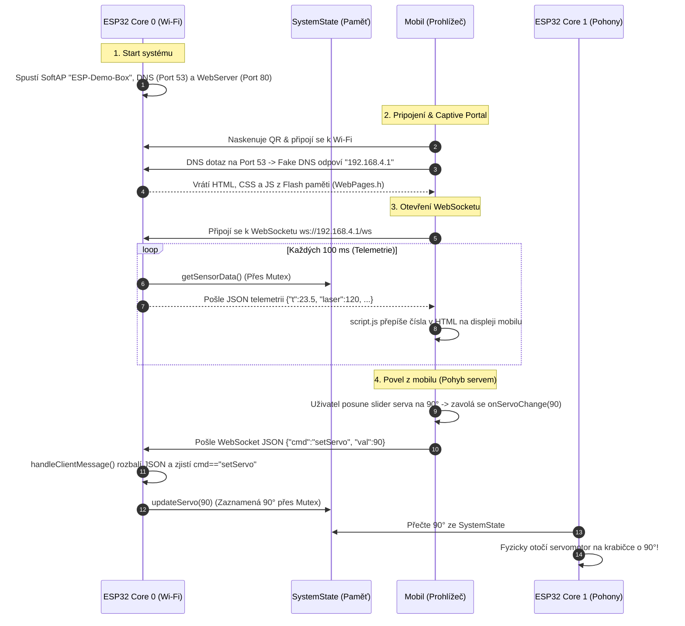

# Jednoduchý průvodce Wi-Fi a Webem (ESP-Demo-Box)

Tento návod ti **lidsky, jednoduše a názorně** vysvětlí, jak celá bezdrátová část v našem Demo-Boxu funguje. Nemusíš být síťový expert – vše je vysvětleno na praktických přirovnáních a na reálném fungování kódu krok za krokem.

---

## 1. Co to celé dělá a jak to funguje v praxi?

Představ si, že přijdeš k hotovému Demo-Boxu:
1. **ESP32 se zapne** a začne se chovat jako malý **Wi-Fi router** (vysílá vlastní Wi-Fi síť s názvem `ESP-Demo-Box`).
2. Ty vezmeš telefon a **fotoaparátem naskenuješ QR kód** na krabičce.
3. Mobil se **bez zadávání hesla připojí**.
4. Během vteřiny mobilu **automaticky vyskočí okno s naším webem** (díky funkci *Captive Portal* – stejně jako když se připojuješ na Wi-Fi v hotelu nebo ve vlaku).
5. Na mobilu vidíš **živé hodnoty ze všech senzorů** (teplota, vzdálenosti, gyroskop, tlačítka) a můžeš prstem **hýbat servy, motorem, rozsvěcet LEDky nebo přepínat hry na displeji**.

---

## 2. Kde co běží? (Backend vs. Frontend)

Aby ses v tom neztratil, musíme si rozdělit svět na dvě části:

```
+------------------------------------+          +------------------------------------+
|       ESP32-S3 (BACKEND)           |          |     MOBILNÍ TELEFON (FRONTEND)     |
|                                    |          |                                    |
| - Běží v čipu v krabičce (Core 0)  |  Wi-Fi   | - Běží v prohlížeči v mobilu       |
| - Kód: WebManager.h a .cpp         | <======> | - Kód: HTML, CSS, JavaScript       |
| - Nemá webový prohlížeč!           | WebSocket| - Zobrazuje tlačítka a barvy       |
| - Stará se o senzory, serva a motory|         | - Počítá dotyky prstů uživatele    |
+------------------------------------+          +------------------------------------+
```

1. **Backend (ESP32 / `WebManager.cpp`):**
   * Běží fyzicky v mikrokontroléru ESP32-S3 na **Core 0**.
   * Nemá žádný prohlížeč ani vykreslovací grafickou kartu pro web.
   * Jeho úkolem je vysílat Wi-Fi signál, přijímat příkazy a starat se o hardware (číst fyzické senzory, hýbat servy a ovládat motory).

2. **Frontend (Mobilní telefon / `index.html`, `style.css`, `script.js`):**
   * Webový kód je sice zkompilovaný a uložený ve Flash paměti ESP32 (`WebPages.h`), ale **ESP32 ho sama nespouští**.
   * Jakmile se mobil připojí, ESP32 pošle tento text přes Wi-Fi do mobilu.
   * **Teprve webový prohlížeč v mobilu** (Safari nebo Chrome) tento kód zpracuje, nakreslí hezká tlačítka a spustí JavaScript. Všechny animace a barvy tak počítá procesor tvého telefonu!

---

## 3. Hlavní pojmy a síťové základy vysvětlené „po lopatě“

### 🚪 A) Co je to HTTP port (Port 80) a DNS port (Port 53)?
Představ si IP adresu (`192.168.4.1`) jako **adresu panelového domu**:
* Aby pošťák věděl, do kterých konkrétních dveří v domě má jít, potřebuje **číslo bytu = PORT**.
* Na jedné IP adrese může běžet více různých síťových služeb, a každá naslouchá u svých vlastních dveří:
  * **Port 80 (HTTP):** Dveře vyhrazené pro webové stránky. Když do prohlížeče napíšeš IP adresu, prohlížeč automaticky klepe na dveře číslo 80.
  * **Port 53 (DNS):** Dveře vyhrazené pro překladač doménových jmen.

---

### 🌐 B) Co je to DNS server (Port 53) a jak funguje Captive Portal?
* **Jak funguje běžný internet:** Když v mobilu napíšeš `seznam.cz`, mobil se zeptá DNS serveru na portu 53: *"Jaká je IP adresa pro seznam.cz?"* DNS server odpoví: `77.75.77.222`.
* **Náš trik (Fake DNS na ESP32):** Naše ESP32 má spuštěný vlastní DNS server na portu 53 (`dnsServer.start(53, "*", "192.168.4.1")`).
* Když se mobil připojí k síti `ESP-Demo-Box`, okamžitě na pozadí zkouší posílat DNS dotazy na internet (zkoumá, zda funguje síť).
* Náš DNS server na **jakýkoliv dotaz z mobilu odpoví: `192.168.4.1`**.
* Mobilní telefon si myslí: *"Aha, tohle je síť v hotelu nebo ve vlaku, kde se musím nejprve přihlásit!"* a **sám automaticky vytáhne okno s naším webem na displej**. Uživatel tak nemusí nikam psát žádnou IP adresu.

---

### ⚡ C) Co je to WebSocket a jak funguje jeho nastavení (`setupWebSocket`)?
Rozdíl mezi běžným webem a WebSocketem:
1. **Běžný web (HTTP):** Mobil klepe na dveře portu 80, požádá o soubor, ESP32 mu ho podá a dveře se zabouchnou. Kdybychom takhle chtěli živá data ze senzorů, mobil by musel klepat 10× za sekundu.
2. **WebSocket (`ws://192.168.4.1/ws`):** Mobil a ESP32 se dohodnou, že po otevření webu **nechají dveře dokořán a vytvoří mezi sebou přímé potrubí**.

**Jak funguje nastavení v kódu C++ (`WebManager.cpp`):**
```cpp
void WebManager::setupWebSocket() {
    ws.onEvent([this](AsyncWebSocket *server, AsyncWebSocketClient *client, 
                      AwsEventType type, void *arg, uint8_t *data, size_t len) {
        this->onWebSocketEvent(server, client, type, arg, data, len);
    });
    server.addHandler(&ws);
}
```
* Tato funkce říká webovému serveru: *"Kdykoliv se na adrese `/ws` cokoliv stane (mobil se připojí, odpojí nebo pošle příkaz), okamžitě zavolej naši funkci `onWebSocketEvent`!"*

---

### 📦 D) Co je to JSON a jak si mobil s ESP32 povídá?
Data mezi mobilem a ESP32 posíláme v jednoduchém textovém formátu **JSON**:

* **Když ESP32 posílá data do mobilu (Telemetrie):**
  ```json
  {"t": 23.5, "h": 48.2, "laser": 150, "led1": true, "mode": 2}
  ```
  *(Znamená to: Teplota 23.5 °C, vlhkost 48.2 %, vzdálenost 150 mm, LED1 svítí, běží mód 2).*

* **Když mobil posílá povel do ESP32 (Ovládání):**
  ```json
  {"cmd": "setServo", "val": 120}
  ```
  *(Znamená to: Nastav servo na 120 stupňů).*

---

### 🧠 E) Proč má ESP32 dvě jádra a proč Wi-Fi běží na Core 0?
Čip **ESP32-S3 má dva nezávislé procesory (Core 0 a Core 1)**:
* **Core 1 (Hry a Displej):** Neustále na plný výkon kreslí grafiku na 2.8" displej (hry Snake, Flappy Bird, vykreslování textu).
* **Core 0 (Wi-Fi):** Stará se o rádiové vlny, síť a web.
* **Proč je to geniální?** Kdyby obojí běželo na jednom jádře, pokaždé, když by mobil stahoval data, displej by se viditelně sekl nebo by kleslo FPS. Takhle běží obě jádra vedle sebe a displej je 100% plynulý.

---

### 🚦 F) Co je to Mutex? (Semafor pro paměť)
* Obě jádra procesoru potřebují sahat na stejná data (např. teplotu ze senzoru nebo polohu joysticku).
* Aby se nestalo, že Core 0 čte teplotu zrovna v polovině zápisu z Core 1 (což by mohlo čip shodit), používáme v souboru `SystemState.h` tzv. **Mutex** (ze slov *Mutual Exclusion*).
* Funguje to jako **semafor na jednokolejné trati**: Než jádro sáhne do paměti, rozsvítí červenou. Druhé jádro počká zlomek mikrosekundy, a jakmile první skončí, semafor se uvolní.

---

### 🛡️ G) Co je to Throttle v JavaScriptu?
* Když na mobilu prstem rychle posouváš jezdec serva nebo motoru z 0 na 180, mobil by vygeneroval klidně 100 zpráv za vteřinu.
* V souboru `script.js` máme funkci `throttle`: ta propustí maximálně 20 zpráv za sekundu (jednu každých 50 ms).
* Pro lidské oko je to naprosto okamžité a plynulé, ale zabrání to zahlcení Wi-Fi fronty v ESP32.

---

### 💾 H) Proč máme web v `WebPages.h` (PROGMEM)?
* V Arduinu se webové soubory často nahrávají do souborového systému *LittleFS* (což vyžaduje speciální nahrávací krok přes *Upload Filesystem Image*).
* My jsme HTML, CSS a JS vložili přímo do souboru `WebPages.h` pomocí klíčového slova `PROGMEM`.
* **Výsledek:** Celý web se zkompiluje přímo do programu. Stačí zmáčknout klasický **Upload** v PlatformIO a nahraje se vše najednout. Navíc se neubírá ani bajt z operační paměti RAM.

---

## 4. Jak to celé funguje dohromady? (Kompletní příklad krok za krokem)

Pojďme si projít kompletní životní cyklus aplikace od stisknutí tlačítka napájení na krabičce až po otočení servomotoru:



### Krok 1: Zapnutí ESP32 (Start Backend částí)
1. Funkce `setup()` v `main.cpp` vytvoří FreeRTOS úlohu `Task_WiFi_Web` připnutou na **Core 0**.
2. Úloha zavolá `webManager.begin(&globalState)`.
3. `begin()` přepne Wi-Fi na Access Point `ESP-Demo-Box`, spustí DNS server na portu 53, nastaví webové směrování (HTTP port 80) a zapne WebSocket na `/ws`.
4. Úloha vstoupí do nekonečného cyklu `for (;;)`, kde neustále dokola volá `webManager.update()`.

### Krok 2: Připojení mobilu a načtení vzhledu (Frontend)
1. Uživatel namíří fotoaparát na QR kód a mobil se připojí k síti `ESP-Demo-Box`.
2. Mobil zkouší na pozadí zjistit internet -> náš DNS server v `webManager.update()` odchytí dotaz na portu 53 a vrátí IP `192.168.4.1`.
3. Mobil vyvolá okno a pošle HTTP požadavek na port 80 (`GET /`).
4. Funkce v `setupRoutes()` vezme text `INDEX_HTML` z Flash paměti (`WebPages.h`) a pošle ho do mobilu. Mobil si pak stejným způsobem stáhne `style.css` a `script.js`.
5. V prohlížeči telefonu se zobrazi tmavé rozhraní s kartami a tlačítky.

### Krok 3: Živá komunikace (WebSocket & Telemetrie)
1. Po načtení stránky sputí `script.js` v mobilu funkci `initWebSocket()` a otevře trvalý kanál na `ws://192.168.4.1/ws`.
2. V ESP32 zachytí událost metoda `ws.onEvent` s typem `WS_EVT_CONNECT`.
3. Při dalším průchodu smyčky `webManager.update()` vidí ESP32 `ws.count() > 0`. Každých 100 ms zavolá `broadcastTelemetry()`.
4. `broadcastTelemetry()` si bezpečně přes Mutex vytáhne snímek dat z `globalState.getSensorData()`, zabalí ho do JSONu a rozesle ho do mobilu.
5. V mobilu přijme zprávu funkce `ws.onmessage`, zavolá `handleTelemetry(d)` a okamžitě přepíše čísla na obrazovce (teplota, vzdálenosti, gyroskop).

### Krok 4: Povel z mobilu (Pohyb servem)
1. Uživatel na mobilu posune slider serva na 90°.
2. Událost `oninput` v `index.html` zavolá v `script.js` funkci `onServoChange(90)`.
3. Funkce `onServoChange` přes omezovač `throttle` zavolá `sendCmd('setServo', {val: 90})`.
4. Mobil pošle přes WebSocket textovou zprávu `{"cmd":"setServo","val":90}`.
5. V ESP32 zachytí událost `ws.onEvent` s typem `WS_EVT_DATA` a předá ji do `handleClientMessage()`.
6. `handleClientMessage()` rozbalí JSON, zjistí `cmd == "setServo"` a zavolá `pState->updateServo(90)`.
7. Vlákno obsluhující pohony na **Core 1** si přečte novou hodnotu 90° ze `SystemState` a fyzicky otočí servomotor na krabičce!

---

## 5. Tahák k maturitní obhajobě (Otázky a odpovědi)

#### Otázka 1: *„Kde fyzicky běží kód webové stránky a kde kód síťového serveru?“*
> **Tvoje odpověď:** *„Kód síťového serveru běží na mikrokontroléru ESP32-S3 na jádře Core 0 v jazyce C++. Kód webové stránky (HTML, CSS a JavaScript) je sice zkompilován ve Flash paměti ESP32, ale po připojení se pošle do mobilního telefonu a spouští se v prohlížeči mobilu. Výpočet animací a vykreslení tlačítek tak provádí procesor telefonu.“*

#### Otázka 2: *„Co je to HTTP port 80 a DNS port 53?“*
> **Tvoje odpověď:** *„IP adresa určuje zařízení v síti. Porty jsou jako konkrétní dveře pro jednotlivé služby. Port 80 je standardní dveře pro webové stránky (HTTP). Port 53 slouží pro DNS překladač domén. Náš DNS server na portu 53 zachytí jakýkoliv dotaz mobilu a přesměruje ho na naši webovou stránku na portu 80 (Captive Portal).“*

#### Otázka 3: *„Jak funguje WebSocket a v čem je lepší než HTTP REST API?“*
> **Tvoje odpověď:** *„HTTP spojení vyžaduje pro každý požadavek sestavení TCP spojení a odeslání HTTP hlaviček, což by při rychlém posílání dat zahltilo síť i procesor. WebSocket po úvodním stáhnutí stránek naváže jedno trvalé obousměrné TCP spojení s minimální režijní zátěží (2 bajty na paket). Umožňuje přenášet telemetrii 10× za sekundu a ihned přijímat povely.“*

#### Otázka 4: *„Jak je vyřešen běh na dvou jádrech ESP32-S3?“*
> **Tvoje odpověď:** *„Využívám operační systém reálného času FreeRTOS. Na Core 1 běží grafika displeje a herní smyčky, zatímco celou Wi-Fi, Captive Portal a WebSockets obsluhuje samostatná úloha na Core 0. Přístup k datům je zabezpečen pomocí Mutexu, aby nedošlo k souběhu.“*

#### Otázka 5: *„Jak šetříte paměť RAM v ESP32?“*
> **Tvoje odpověď:** *„Webové soubory jsou uloženy ve Flash paměti programu přes makro PROGMEM. Pro JSON zprávy používám ArduinoJson v7 s pevnou alokací na zásobníku (stack), takže nedochází k fragmentaci paměti haldy (heap). Navíc, pokud není připojen žádný klient, generování JSONu se úplně přeskakuje.“*

#### Otázka 6: *„Jak to, že má ESP32 anténku dlouhou jen cca 3 cm, když vlnová délka 2.4 GHz je 12.4 cm?“*
> **Tvoje odpověď:** *„Anténa nemusí mít délku celé vlnové délky. Pro nejlepší rezonanci se používá čtvrtvlnný rezonátor (lambda / 4). Když spočítáme čtvrtinu z 12.4 cm: 12.4 / 4 = 3.1 cm! Přesně 3.1 cm dlouhá měděná cestička je fyzikálně ideální rezonátor pro frekvenci 2.4 GHz.“*

#### Otázka 7: *„Nezinterferují vlny mezi sebou, když je anténa na plošném spoji zohýbaná (meandrovaná)?“*
> **Tvoje odpověď:** *„Ne, zohýbání (tzv. Meander Line Antenna) je přesně matematicky navržené tak, aby se 3.1 cm dlouhá anténa vešla na malou desku. Vzdálenosti ohybů jsou spočítané tak, aby se vyzařovaná elektromagnetická pole z protilehlých ramen nepůsobila destruktivně, ale naopak se konstruktivně sčítala.“*

#### Otázka 8: *„Když elektromagnetická vlna letí rychlostí světla, jak ji mobil dokáže dekódovat?“*
> **Tvoje odpověď:** *„Přijímač v mobilu neposuzuje rychlost letu vlny prostorem. Vlna po dopadu na anténu mobilu indukuje střídavý elektrický proud kmitající na frekvenci 2.4 GHz. Vysokorychlostní Wi-Fi modem v mobilu pak dekóduje posuny fáze a výšku těchto kmitů přímo v reálném čase.“*
